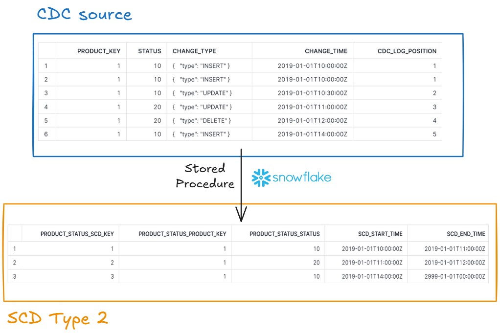

# Implementing an SCD Type 2 dimension from a CDC source using Snowflakes's Stored procedure and Data Quality Checks 

 

## Table of Contents

- [Project Structure](#project-structure)
- [Tasks](#tasks)
- [Proposed SCD Type 2 Solution](#proposed-scd-type-2-solution)
- [Setup Instructions](#setup-instructions)
  - [Prerequisites](#prerequisites)
  - [Environment Variables](#environment-variables)
  - [Initiate the Environment](#initiate-the-environment)

## Project Structure

- **my_project (project-root)/**
    - **.venv/**
    - **img/**
    - **.env**
    - **.gitignore**
    - **.python-version**
    - **requirements.txt**
    - **README.md**

## Tasks

**Implementing an SCD Type 2 Dimension from a CDC Source**

This task involves implementing a Slowly Changing Dimension (SCD) Type 2 to track changes to a product’s status over time within the corporate data warehouse (DWH). The source for this dimension is a Change Data Capture (CDC) stream that logs all data modification events (DML operations) from a transactional system. The main goal is to maintain historical records of product status changes, based on an ordered and deduplicated stream of changes.

* **CDC Stream Handling**: Ensure the stream data is processed in the exact order of events and deduplicate any duplicate records to prevent redundant updates.

* **Transformation Logic**:
  * Identify records where changes in the product's status are significant and update the SCD table accordingly.
  * Handle idempotency to support reprocessing, ensuring that the process does not alter existing data on repeated runs.

* **SCD Type 2 Design**: Structure the DWH table with start and end timestamps for each record to track when each product status was effective.

* **Edge Case Management**:
  * Recognize records with no effective change to prevent unnecessary updates.
  * Manage scenarios with multiple inserts, deletions, or gaps between operations, ensuring correct SCD records.

* **Output**: Maintain a clean, efficient SCD table that accurately reflects each change in product status, providing an easily queryable history for analytics.

This implementation is critical for maintaining a reliable historical record of product statuses within the DWH, following dimensional modeling practices as per Kimball's approach.

## Proposed SCD Type 2 Solution

The stored procedure is designed to handle Slowly Changing Dimensions (SCD) Type 2 in Snowflake for a product_status_hst history table, using a product_status_cdc change data capture (CDC) table as the source. Here is a summary of its key operations:

* **Data Preparation**:
  * **deduplicated_cdc**: Selects unique records from the CDC table, extracting necessary fields (product_key, status, change_type, change_time, and cdc_log_position).
  * **hash_table_1**: Calculates a hash for each row, identifying changes in product_key or status by comparing current and previous hash values.
  * **hash_table_2**: Filters rows with changed values to ensure only unique modifications are passed forward.
  * **final_table**: Adds previous status information and determines if a row is currently active, considering the change_type (e.g., ignoring inactive records after a DELETE operation).
  * **scd_table**: Builds the final table for the SCD Type 2, setting scd_start_time and scd_end_time based on the change_time, defaulting future scd_end_time to 2999-01-01 for active records.

* **Merge Operation**:
  * **MERGE INTO ... AS target USING (...) AS source ON ...**: 
    * A MERGE statement compares the target (existing records in `product_status_hst`) with the source (new/updated records in scd_table). 
    * The matching process uses the following keys: 
      * `product_status_product_key`, `product_status_status`, `scd_start_time`, `scd_end_time`
    * It does use `product_status_product_key` because if it did, it would wrongly update it in the target depending on the cdc_log_position being used.
      * For example, if we use the condition `cdc_log_position > 1`, than the source would contain only 2 rows and the `product_status_product_key` would go from 1 to 2 (instead of 1 to 3) and it would mess with the target enumeration process.
  * **Update Condition (WHEN MATCHED AND ...cdc_log_position > ...)**: If there is a match and the `cdc_log_position` is greater than the a chosen starting point, it updates only the rows after this starting point for the following columns in the target: `product_status_status`, `scd_start_time`, and `scd_end_time`.
  * **Insert Condition**: If there is no match, it inserts the new record with all relevant columns, preserving the SCD history.

* **Execution**:
  * The constructed SQL query is executed immediately, returning a success message indicating that CDC processing is complete.

This procedure efficiently manages SCD Type 2 by ensuring only unique changes are recorded, maintaining a complete history of status changes per product_key, and updating the history table incrementally based on the latest CDC log position.


## Setup Instructions

### Prerequisites

Make sure you have the following installed on your local development environment:

* [VSCode](https://code.visualstudio.com/)
  * Install `GitLens — Git supercharged` extension and Jupyter Notebook extensions.
* [Pyenv](https://github.com/pyenv-win/pyenv-win)
  * This is not mandatory.
  * This is just to help you manage both the Global (on your machine) and Local (for your project) Python Versions.
  * Open Windows Powershell and follow the instructions from the Pyenv website, which are:
    * `Invoke-WebRequest -UseBasicParsing -Uri "https://raw.githubusercontent.com/pyenv-win/pyenv-win/master/pyenv-win/install-pyenv-win.ps1" -OutFile "./install-pyenv-win.ps1"; &"./install-pyenv-win.ps1"`
  * If there is an error, try this:
    * `Set-ExecutionPolicy -ExecutionPolicy RemoteSigned -Scope CurrentUser`
  * Then, try the command above again
  * Open Git Bash:
    * pyenv --version (This will show if pyenv was installed successfully)
  * Create Pyenv Environment Variables in Windows
    * Windows Flag on your Keyboard + R:
      * sysdm.cpl -> Advanced Tab -> Environment Variables
      * Get the `pyenv-win` folder path. Usually, it is created here: `C:\Users\YOUR_USER\.pyenv\pyenv-win\`
      * Create 3 variables in the "User variables for YOUR_USER" part, and put the path above to each of them:
        * PYENV, PYENV_ROOT, PYENV_HOME
      * Double-click `Path` in the same part and click on New and add the paths for `bin` and for `shims`
        * `C:\Users\YOUR_USER\.pyenv\pyenv-win\bin`
        * `C:\Users\YOUR_USER\.pyenv\pyenv-win\shims`
        * Move both of them to the top (This will allow pyenv to have preference over the other python interpreters)
    * Check if it is working: Git Bash -> pyenv
  * Install Python Versions (This will install the python version that will be linked to different project with pyenv)
    * pyenv install 3.12.1
    * pyenv install 3.9.13
    * Check with: pyenv versions
  * Configure the Global Python version for your machine:
    * pyenv global 3.12.1
    * pyenv global (This will show the current global python version)
  * Configure the Local Python version for your project 
    * cd your_repo_folder
    * pyenv local 3.9.13 (This will create a `.python-version` file in your repo folder with the local version of your project)
    * Check with: python --version
* [.venv - Virtual Environment](https://docs.python.org/3/library/venv.html)
  * cd your_repo_folder:
    * `cd "C:\PATH_TO_YOUR_FOLDER"`
  * `python -m venv .venv`           (This will create a virtual environment for the repo folder)
  * `source .venv/Scripts/activate`  (This will activate your virtual environment)
  * Install everything you need for your project from the `requirements.txt` file:
    * make sure to update pip, this is important to avoid conflicts: `python.exe -m pip install --upgrade pip`
    * `pip install --no-cache-dir -r requirements.txt`  (This will install things inside your virtual environment)
    * Check: pip list

Make sure to inclue a .gitignore file with the following information:

* .venv/         (to ignore the virtual environment stuff)
* *.pyc          (to ignore python bytecode files)
* .env           (to ignore sensitive information, such as database credentials)

### Environment Variables
The .gitignore file, ignores the `.env` file for security reasons. However, since this is just for educational purposes, follow the step below to include it in your project. If you do not include it, the docker will not work.

Create a `.env` file in the project root with the following content:

SNOWFLAKE_PORT=443 
SNOWFLAKE_USER=YOUR_USER
SNOWFLAKE_ROLE=YOUR_ROLE
SNOWFLAKE_PASSWORD=YOUR_PASSWORD
SNOWFLAKE_ACCOUNT=YOUR_ACCOUNT
SNOWFLAKE_ACCOUNT_URL=https://YOUR_HOST.YOUR_REGION.aws.snowflakecomputing.com
SNOWFLAKE_WAREHOUSE=MY_WAREHOUSE
SNOWFLAKE_DATABASE=MY_DATABASE
SNOWFLAKE_SCHEMA=MY_SCHEMA
SNOWFLAKE_PRODUCT_STATUS_CDC=PRODUCT_STATUS_CDC
SNOWFLAKE_PRODUCT_STATUS_HST=PRODUCT_STATUS_HST

If you want to check the environment variables from your current folder, do:
* printenv (this will show if the environmental variables were loaded within the Docker container)
* printenv | grep SNOWFLAKE (this functions as a filter to show only the variables that contain 'POSTGRES')

### Initiate the Environment

1. **Clone the repository:**

   ```bash
   git clone YOUR_GIT_REPO_URL.git
   cd "C:\PATH_TO_FOLDER"

2. **Activate you Virtual Environment (.venv)**

* cd "C:\PATH_TO_FOLDER"
* source .venv/Scripts/activate